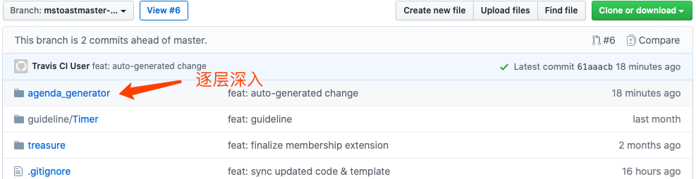
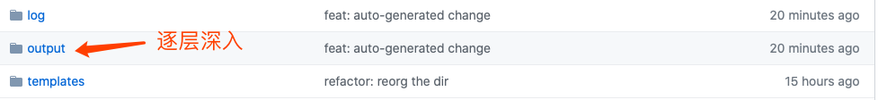
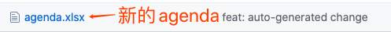
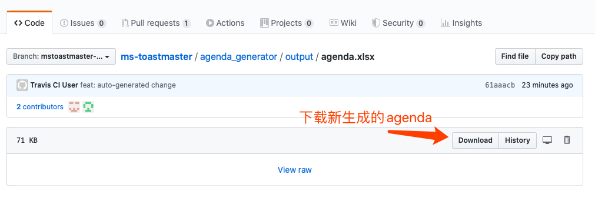

# Agenda 生成器
## Travis CI
1. 使用账号 mstoastmaster 登录 Github

2. 查看并根据最新的call role 结果更新[目标文件](https://github.com/eliiotz/ms-toastmaster/blob/master/agenda_generator/data/meeting.txt)。

   

3. 修改目标文件（注意请保持格式一致并尽可能去除特殊字符），选中“创建新分支”，最后点击“propose file change”

   

4. 使用默认设置创建Pull Request

   

5. 此时系统会自动开始运行生成agenda的任务，请耐心等待

   

6. 点击commits以确认任务完成情况。任务完成后会生成一个名为"feat: auto-generated change"的commit。该commit生成后点击上方的链接（在新窗口中打开）前往feat分支以下载生成的agenda

   

7. 按照agenda_generator -> output -> agenda.html 的顺序找到新生成的agenda，下载并查看

   agenda_generator

   

   output

   

   agenda.xlsx

   

   Download file

   

8. 如果agenda有误，回到1；如果agenda无误，回到之前的窗口，调整merge方式为squash and merge，完成Pull Request

   

9. 对于线下会议，记得打开腾讯问卷清空一下历史数据

   

