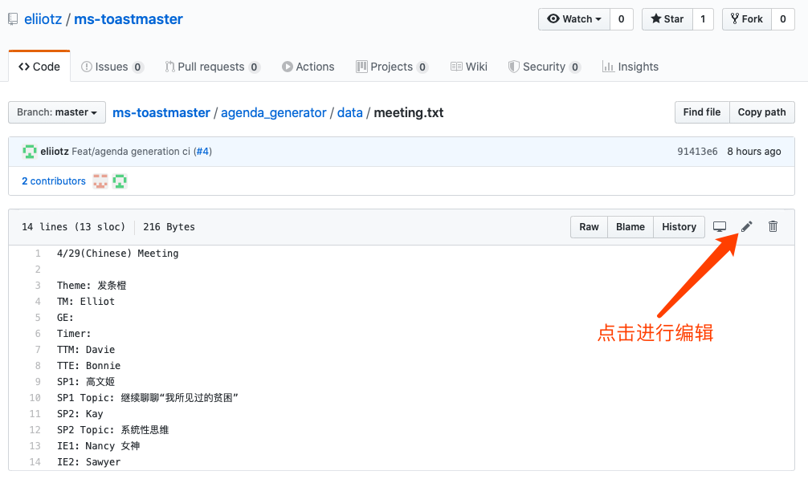
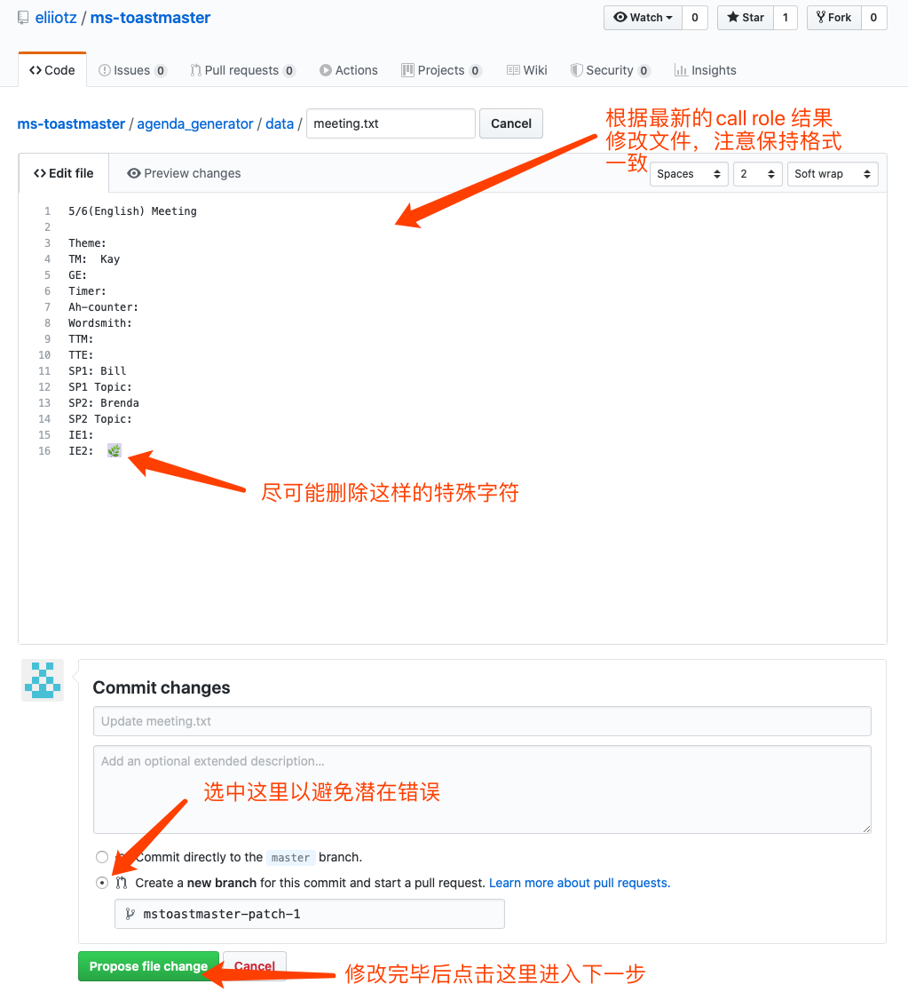
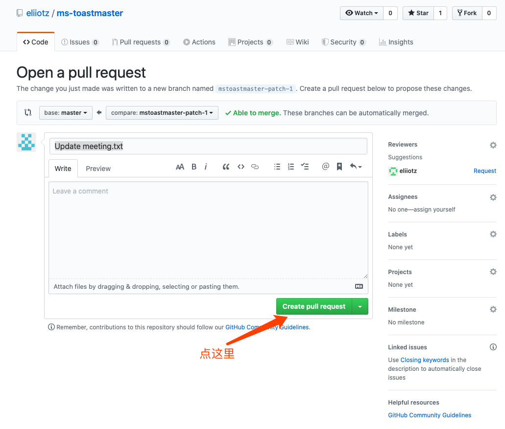
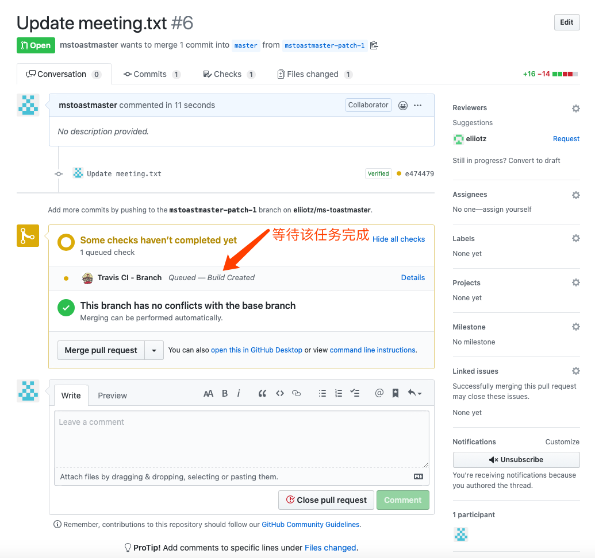
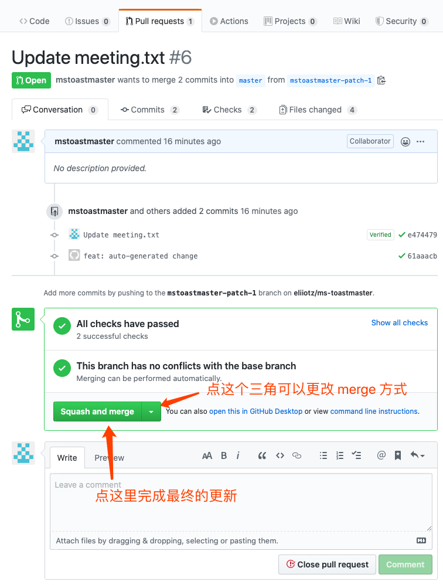

# Agenda 生成器
## Travis CI
1. 使用账号 mstoastmaster 登录 Github

2. 查看并根据最新的call role 结果更新[目标文件](https://github.com/eliiotz/ms-toastmaster/blob/master/agenda_generator/data/meeting.txt)。

   

3. 修改目标文件（注意请保持格式一致并尽可能去除特殊字符），选中“创建新分支”，最后点击“propose file change”

   

4. 使用默认设置创建Pull Request

   

5. 此时系统会自动开始运行生成agenda的任务，请耐心等待

   

6. 一段时间后，conversation中会出现一个新的change，在其详细信息中包含preview link

   

7. 如果预览后发现信息有误，可以通过直接修改feature branch中的内容或回到1来对会议信息进行更新

8. 所有会议信息录入完成后，调整merge方式为squash and merge，完成Pull Request

   

9. 对于线下会议，记得打开腾讯问卷清空一下历史数据

   

